<!-- Generated by GitHub Profile Agent Console. Edit profile.config.json, then run npm run generate. -->

  <picture>
    <source media="(max-width: 760px) and (prefers-color-scheme: dark)" srcset="./assets/hero/agent-console-856bddc0-mobile-dark.svg">
    <source media="(max-width: 760px)" srcset="./assets/hero/agent-console-856bddc0-mobile-light.svg">
    <source media="(prefers-color-scheme: dark)" srcset="./assets/hero/agent-console-856bddc0-dark.svg">
    <source media="(prefers-color-scheme: light)" srcset="./assets/hero/agent-console-856bddc0-light.svg">
    
  </picture>

<h1 align="center">Hi, I'm Vaidik Pipaliya 👋</h1>

  <strong>AI Developer | Machine Learning Engineer | MCA Student</strong>

  
  
  

  

---

## 🛠️ Tech Stack & Skill Levels

  <!-- Devicons Row -->
  
  
  
  
  
  
  
  
  
  
    
  
  <!-- Shields.io Skill Badges -->
  
  
  
  
  

---

## 🔥 Featured Projects

| Project Name | Primary Stack | Core Description |
| :--- | :--- | :--- |
| 🤖 **AgriVerse-Ai** | Python, ML, CNNs | An agricultural computer vision engine that detects crop diseases from plant pictures. |
| 🧠 **BudgetBrain** | Python, Flask, JavaScript | An intelligent personal finance manager with predictive budgeting analysis. |
| 🤖 **potens-intern-ai** | Python, ML, AI Agents | An agentic AI workflow coordination system built for automated document classification. |

---

## 📊 GitHub Metrics & Trophies

<table align="center" width="100%">
  <tr>
    <td align="center" width="50%">
      
    </td>
    <td align="center" width="50%">
      
    </td>
  </tr>
  <tr>
    <td align="center" colspan="2">
      
    </td>
  </tr>
</table>

  <strong>🏆 GitHub Trophies</strong>  
  

---

## 📈 3D Contribution Calendar

  <picture>
    
  </picture>

---

## 🧩 Competitive Coding Profiles

  
  

---

## ✍️ Recent Medium Articles

  <table width="100%">
    <tr>
      <td align="center" width="33%">
        
      </td>
      <td align="center" width="33%">
        
      </td>
      <td align="center" width="33%">
        
      </td>
    </tr>
  </table>

---

## 💡 Developer Quotes & Activity

<table align="center" width="100%">
  <tr>
    <td align="center" width="50%">
      
    </td>
    <td align="center" width="50%">
      
    </td>
  </tr>
</table>

### ⚡ Recent Activity
<!-- AUTO:ACTIVITY:START -->
- Jul 22, 2026: pushed 1 commit to [Vaidik-Pipaliya/DSA_python](https://github.com/Vaidik-Pipaliya/DSA_python).
- Jul 20, 2026: pushed 1 commit to [Vaidik-Pipaliya/Smart-traffic-system](https://github.com/Vaidik-Pipaliya/Smart-traffic-system).
- Jul 20, 2026: created a branch in [Vaidik-Pipaliya/Smart-traffic-system](https://github.com/Vaidik-Pipaliya/Smart-traffic-system).
- Jul 20, 2026: pushed 1 commit to [Vaidik-Pipaliya/DSA_python](https://github.com/Vaidik-Pipaliya/DSA_python).
- Jul 19, 2026: pushed 1 commit to [Vaidik-Pipaliya/DSA_python](https://github.com/Vaidik-Pipaliya/DSA_python).
- Jul 18, 2026: pushed 1 commit to [Vaidik-Pipaliya/Vaidik-Pipaliya](https://github.com/Vaidik-Pipaliya/Vaidik-Pipaliya).
<!-- AUTO:ACTIVITY:END -->
