<!-- Generated by GitHub Profile Agent Console. Edit profile.config.json, then run npm run generate. -->

  <picture>
    <source media="(max-width: 760px) and (prefers-color-scheme: dark)" srcset="./assets/hero/agent-console-982ec891-mobile-dark.svg">
    <source media="(max-width: 760px)" srcset="./assets/hero/agent-console-982ec891-mobile-light.svg">
    <source media="(prefers-color-scheme: dark)" srcset="./assets/hero/agent-console-982ec891-dark.svg">
    <source media="(prefers-color-scheme: light)" srcset="./assets/hero/agent-console-982ec891-light.svg">
    
  </picture>

  
  
  
  

## About Me

I am an MCA student and aspiring software engineer passionate about Machine Learning, Natural Language Processing, and Data Analytics.

I focus on building real-world projects such as reservation systems and ML-based detection apps using Python, Flask, and JavaScript.

## Current Focus

| Area | What I am exploring |
| --- | --- |
| **Machine Learning** | Building and fine-tuning models for classification, NLP, and predictive analytics. |
| **Web Development** | Creating backend systems and dynamic user interfaces using Flask, Django, and JavaScript. |
| **Data Analytics** | Extracting insights from complex datasets and visualizing patterns for decision making. |

## Featured Work

| Project | Focus | Why it matters |
| --- | --- | --- |
| [**RestFast**](https://github.com/Vaidik-Pipaliya/RestFast) | Restaurant Booking System | A dining reservation platform built with HTML, CSS, and JavaScript, featuring table booking and a 2-hour limit live countdown. |
| [**CyberGuard**](https://github.com/Vaidik-Pipaliya/cyberbullying-detection) | ML & NLP Classification | Detects abusive and harmful cyberbullying content on social platforms using Python, Flask, and Machine Learning. |
| [**Krishi Rakshak**](https://github.com/Vaidik-Pipaliya/krishi-rakshak) | Agricultural Computer Vision | A farming assistant that detects crop and plant diseases from uploaded images using Python, Flask, and ML/CNNs. |

## Research Direction

My exploration centers on applying machine learning algorithms to practical problems, from natural language classification (hate speech detection) to agricultural computer vision diagnostics.

## Tech Stack

`Python` · `Flask` · `Django` · `JavaScript` · `HTML` · `CSS` · `Machine Learning` · `NLP`

## Recent Activity

<!-- AUTO:ACTIVITY:START -->
_Recent public activity will appear here after the workflow runs._
<!-- AUTO:ACTIVITY:END -->

---

  Striving to build intelligent, practical software solutions.

